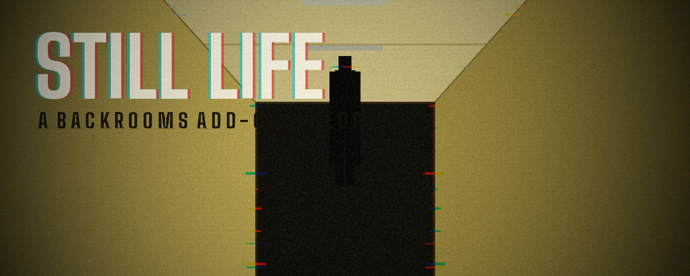
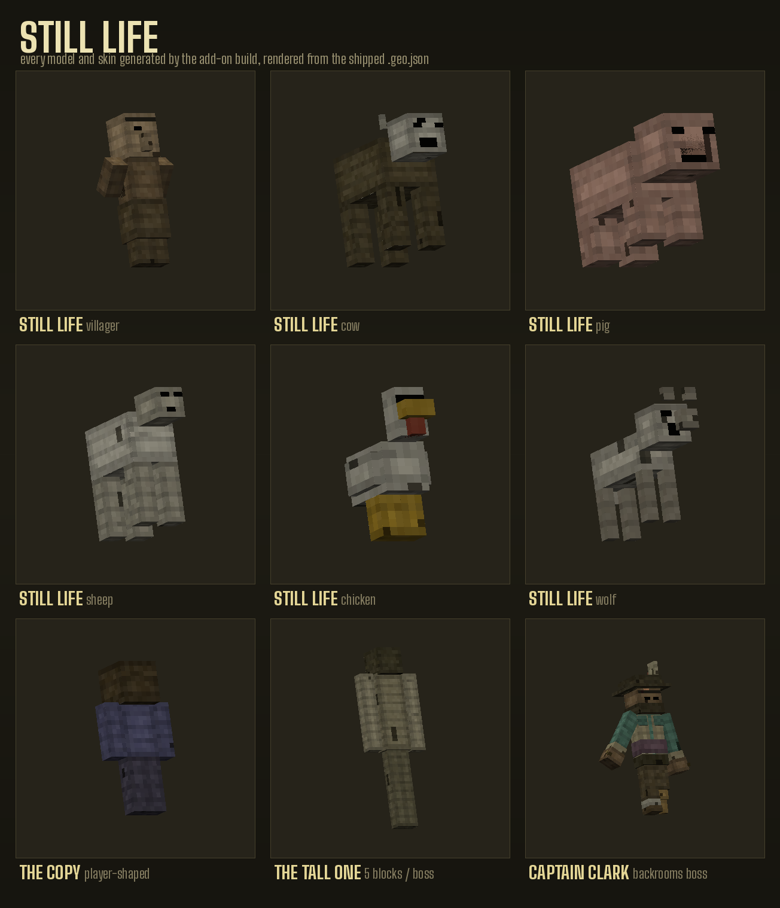
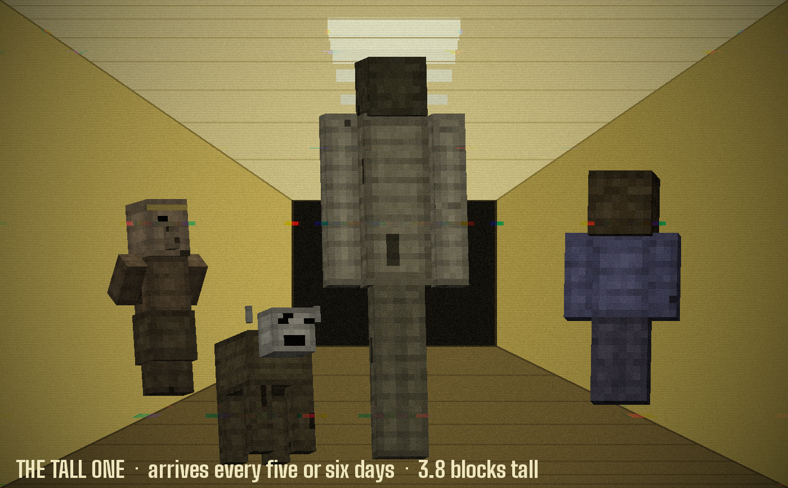
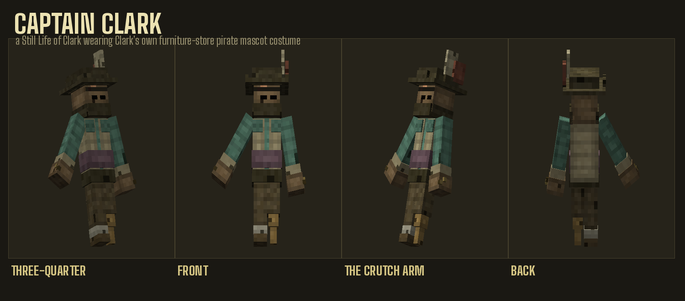
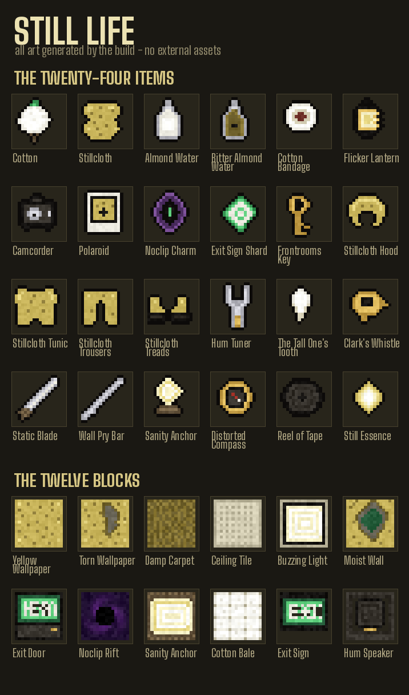

<p align="center">
  
</p>

# STILL LIFE — a Backrooms add-on for Minecraft: Bedrock Edition

The world has started making copies of things. It is not very good at it.

Villagers, cows, pigs, sheep, chickens and wolves get recreated with the right
silhouette, the right walk cycle and *everything else wrong* — sallow, torn,
proportioned by something working from memory. Most of them stand perfectly
still until they have a reason not to. Some of them can be befriended. Some of
those change their minds.

Meanwhile the world keeps a ledger on you, gets steadily less convincing as the
days pass, rebuilds your houses somewhere you have not been, and every five or
six days sends something very tall to stand behind you.

**Everything in this repository is generated by the build** — every model,
texture, icon, animation curve and minute of music. There are no external
assets.

---

## Contents

| | |
|---|---|
| **Add-on** | `dist/StillLife.mcaddon` (2.3 MB) |
| **Mobs** | 9 (6 still lifes, The Copy, The Tall One, Captain Clark) |
| **Items** | 24 |
| **Blocks** | 12 |
| **Recipes** | 27 |
| **Music & SFX** | 24 synthesised Ogg Vorbis tracks (~8 minutes of score) |
| **Min. version** | Bedrock 1.21.0 |

---

## Install

1. Download `dist/StillLife.mcaddon`.
2. Open it — Minecraft imports both packs automatically.
3. Create or edit a world → **Behavior Packs** → activate **STILL LIFE**.
   The resource pack is pulled in as a dependency; if it is not, activate it
   under **Resource Packs** too.
4. Leave the world's experiments alone. Nothing here needs a toggle on 1.21+.
   *(If entities render as white cubes on an older build, switch on
   **Beta APIs** and reload.)*

Prefer the packs separately? `dist/StillLife_BP.mcpack` and
`dist/StillLife_RP.mcpack`.

---

## The still lifes

<p align="center"></p>

They use **the same animation maths vanilla uses** — the limb swing is
`cos(distance_moved × 38.17) × 28.647 × move_speed`, the same curve that drives
a real villager — so a still life walks like the thing it is copying. The
wrongness is layered *on top*: a persistent per-entity distortion animation
that stretches the head, skews the torso and lets one arm hang longer than the
other. Two still lifes standing side by side are warped differently, because
each rolls its own `sl_skew` once and keeps it forever.

**Their behaviour, in the film's terms:**

| State | What it does |
|---|---|
| **still** | Does not move. At all. Occasionally, slowly, turns to look at you. |
| **roaming** | Has decided to walk somewhere. |
| **fleeing** | Something frightened it, so it left. Monsters and the Tall One trigger this automatically. |
| **neutral** | Hits back. Only if you start it. |
| **hostile** | Was already wrong when it spawned. |
| **friendly** | You fed it Cotton or Almond Water. It follows you and fights for you. |
| **betraying** | You fed it, and then you were cruel to something else. |

A newly spawned still life rolls 58% still / 24% roaming / 12% neutral /
6% hostile — so a passive-looking mob genuinely might not be.

**Jump scares** are real spawns, not particles: a still life materialises
2–5 blocks in front of or behind you, already facing you, frozen mid-lunge,
with a stinger. A second later it decides what it is — and *that* decision
reads your ledger.

**Every still life drops the same thing whatever shape it was wearing:**
Cotton or white wool, and occasionally Still Essence.

---

## The ledger

The world keeps a per-player number from -100 to +100, and tells you how it
feels in words: *fond, curious, indifferent, resentful, hateful*.

| | |
|---|---|
| Befriend a still life | **+5** |
| Breed an animal | **+2** |
| Clear a monster | **+1** |
| Kill a peaceful animal | **-3** |
| Kill a still life | **-5** |
| Kill a villager | **-9** |
| Kill something that trusted you | **-18** |

This is not decoration. It sets the betrayal chance for everything you have
befriended, from 0% at *fond* to 62% at *hateful* — and it is what The Tall One
checks while it is holding you.

---

## The Tall One

<p align="center"></p>

Every **five or six in-game days** it spawns directly behind you, wherever you
are. 3.8 blocks tall, 260 HP, a real boss bar, and a movement speed of `0.265`
— deliberately mid-paced. You cannot walk away from it. It will not be on top
of you in two seconds either.

Offer it **Still Essence** or **The Tall One's Tooth** and it may stop hunting
and start walking with you. Your chance is `22% + your ledger`.

Once bonded, it will occasionally **pick you up** — it uses a real rideable
seat, so you are genuinely in its hands, four blocks off the ground, for two
seconds. Then:

- **ledger ≥ +55** → it sets you down. Gently. Every time.
- otherwise → the betrayal roll. If it goes badly it **bites**: 14 damage, -30
  sanity, and it comes back enraged at 0.33 speed and 14 damage.

How it treats you is decided entirely by how you treated everything else.

---

## Sanity

Bedrock has no API for adding a HUD bar, so it renders in the action bar, in
plain ASCII (the Bedrock glyph atlas cannot be trusted with box-drawing
characters on every platform):

```
SANITY [|||||||||||||||-----] 74%
```

**Drains** in darkness, near still lifes, near a boss, in the Backrooms, and as
corruption rises. **Recovers** in bright light, from Almond Water, from
sleeping, near a Sanity Anchor, and near still lifes that like you.

| Below | What happens |
|---|---|
| 70% | whispers |
| 45% | nausea, a heartbeat you can hear |
| 25% | blindness flickers, slowness, and **hallucinations** — real still lifes that vanish after a few seconds |
| 8% | darkness, and a small chance every few seconds that **the floor stops holding you** and you noclip straight into the Backrooms |

---

## Corruption — the world getting worse at pretending

One number, 0–100, that climbs roughly a point a day and never falls. It is the
intensity dial for everything:

- **Terrain distortion.** Damp carpet spreading across grass, wallpapered walls
  rising out of hillsides, freestanding doorframes, pillars, ceiling slabs
  floating over nothing, sinkholes lined in wallpaper, trees whose leaves have
  been remembered as cotton bales, and — past 55% — whole wallpapered rooms
  half-swallowed by the ground.
- **Still lifes get worse.** Corruption sets their `sl:decay` tier, which swaps
  in progressively more degraded textures and cranks the distortion animation.
- **More of everything**: spawn rate, jump-scare frequency, rift frequency.
- **The score changes.** Past 70% the calm tracks stop and *The World Is Done
  Pretending* takes over.
- **The haze thickens** — a custom fog definition pushed at 25%.

> **Safety rule:** the distortion pass only ever overwrites *natural* blocks —
> grass, dirt, stone, sand, leaves, logs. Anything you placed yourself is never
> touched.

---

## It rebuilds what you build

Every block you place is watched. Once you have made something of a reasonable
size and then walked away from it for 25 seconds, the world files it.

Later, somewhere 140–380 blocks away, it puts it up again:

- **twice the size** in every axis
- **rotated** 90/180/270°
- **materials swapped** — oak becomes dark oak, glass becomes wallpaper,
  torches become buzzing lights, wool becomes cotton bale
- **the plan changed** — each course of blocks slides sideways independently,
  so the footprint is not your footprint
- **7% of it simply missing**
- **shoved 2–5 blocks into the ground**, clipping through the terrain

You are meant to recognise it. Recreations are built inside a temporary
ticking area, so they go up out where you have not been yet, and everyone gets
told when one finishes.

**Distorted villages** work the same way: 4–8 half-buried house shells with
walls that do not go up straight, roofs with holes, damp-carpet paths that lead
between houses and stop — and **no villagers**. Sometimes a copy of one,
standing in a doorway, not moving.

---

## The Backrooms

Bedrock will not let an add-on register a real custom dimension. Rather than
fake one badly, this claims a patch of the End so far out that nothing else
will ever be there (`x/z ≈ 256,000`), seals it, and builds **Level 0** inside
it: five-block ceilings, damp carpet, mono-yellow wallpaper, and lights that
buzz and fail.

**Four ways in:**

1. **Noclip Charm** — face a wall within four blocks and push.
2. Walk into a **Noclip Rift** — they start appearing in the overworld past 32% corruption.
3. An **Exit Door** opening onto the wrong side.
4. **Sanity below 8%** — the floor gives way on its own.

Sectors are 48×48 and generated deterministically from their coordinates, so
walking back the way you came gives you back the same rooms. The wall grid is
keyed to *global* cell coordinates, so sectors stitch together with no seam.

**Getting out:** find an Exit Door, use an **Exit Sign Shard**, or make a door
where there was wall with the **Frontrooms Key**.

### Captain Clark

<p align="center"></p>

Somewhere six to nine sectors from where you came in is a chamber: one enormous
open floor, every light on, no cover. 340 HP, a boss bar, and a darkened sky.

He is not a monster the Backrooms invented. He is a **Still Life of Clark
wearing Clark's own costume** — Cap'n Clark, the pirate mascot from the
furniture-store commercial he shot himself. The world copied the man at the
worst possible moment and got the details almost right: tricorne with two
feathers, turquoise button-up with big collars under a long beige vest, purple
sash, dark brown trousers, a white sock and a brown Oxford on the right foot
and an amber wooden peg on the left. Eight fingers on each hand, brass rings on
both. He stands about 2.4 blocks — a head and a half over you, nowhere near
the Tall One.

And his right arm is still held out at an angle, because on the day it copied
him there was a crutch tucked under it, and the copy kept the shape but not
the crutch.

- **66% HP** — he stops being careful. Charge attacks, 15 damage.
- **33% HP** — 18 damage, immune to knockback, and he starts making copies of
  the people he has met, three at a time.

**The gear is the fight:**

| Item | Effect |
|---|---|
| **Static Blade** | +7 bonus damage to either boss, +4 to still lifes |
| **Stillcloth armour** | Heals back 12% of boss damage per piece worn — 48% for the full set |
| **Hum Tuner** | Stuns him for 6 seconds and doubles all damage he takes |
| **Flicker Lantern** | Night vision that keeps cutting out |
| **Camcorder** | Marks every still life and boss within 42 blocks with glowing |
| **Bitter Almond Water** | +58 sanity, night vision, and for 45 seconds you can see all of them |

He comes back ten days after you put him down.

---

## The twenty-four items

<p align="center"></p>

Cotton is the spine of the tree: still lifes → **Cotton** → **Stillcloth** →
the armour set, the Sanity Anchor, and the ceiling tiles. **Still Essence**
(11% drop) is the spine of the gear: the Static Blade, the Hum Tuner, the
Flicker Lantern and the Noclip Charm all want it.

---

## The music

Eight minutes of score, synthesised from scratch to Ogg Vorbis by
`tools/gen_audio.py` — detuned pads beating slowly against each other, tape
wow and flutter, a Schroeder reverb sized like a very large carpeted box, and
a 120 Hz fluorescent hum sitting underneath all of it.

| Track | When |
|---|---|
| *Empty Rooms* | the overworld, once the world starts noticing you |
| *Wrong Sun* | daylight that does not feel like daylight |
| *It Is Standing Behind You* | almost nothing, and that is the point |
| *Level 0* | the Backrooms — two ballasts slightly out of tune, beating |
| *The Tall One* | a heartbeat that is not yours, at 46 BPM |
| *Captain Clark* | a drum cadence that keeps dropping a beat |
| *The World Is Done Pretending* | past 70% corruption |

The director leaves **deliberate stretches of silence** in the calm case. An
ambient track that never stops is wallpaper, and wallpaper is not tense.

---

## Commands

| | |
|---|---|
| `!sl` / `!sl status` | sanity, ledger, corruption, day |
| `!sl help` | the list |
| `!sl corrupt <0-100>` | set world corruption |
| `!sl tall` | call The Tall One now |
| `!sl recreate` | rebuild one of your builds now |
| `!sl village` | put up a distorted village now |

The **Distorted Compass** shows the same read-out plus a bearing to the nearest
recreation, village or photograph.

---

## Honest limitations

These are Bedrock platform limits, not shortcuts — worth knowing before you
read the code:

- **No custom dimensions.** The Backrooms is a sealed, script-built region of
  the End rather than a registered dimension.
- **No script access to chunk generation.** World distortion is applied to
  terrain *after* it loads, in a ring around each player, throttled by a per-
  pass budget. It cannot change the shape of a chunk before you arrive.
- **No custom HUD elements.** Sanity uses the action bar.
- **`/fog push` stacks**, so fog is only ever pushed on a state transition.
  (This add-on's own harness caught that one.)

---

## Building from source

```bash
./build.sh              # regenerate everything, validate, package
SKIP_AUDIO=1 ./build.sh # skip the ~12s audio synthesis pass
```

| Script | Produces |
|---|---|
| `tools/mobdefs.py` | the model definitions, in a small cube/bone DSL |
| `tools/gen_entities.py` | `.geo.json` + matching textures, UVs auto-packed |
| `tools/gen_art.py` | item/block sprites, flipbooks, logo, banner, pack icons |
| `tools/gen_audio.py` | all 24 Ogg Vorbis tracks |
| `tools/gen_rp.py` | client entities, animations, controllers, atlases, lang |
| `tools/gen_bp_entities.py` | the entity state machines |
| `tools/gen_bp_content.py` | items, blocks, recipes, loot, spawn rules |
| `tools/validate.py` | cross-references every asset path both packs claim |
| `tools/render.py` | the preview images in `docs/` |

### Testing

```bash
python3 tools/validate.py     # 14 checks across both packs
./tools/harness/run.sh        # boot the scripts against a stubbed Bedrock API
```

`validate.py` resolves every geometry id, animation id, bone name, texture
path, sound file, recipe ingredient, loot entry, entity event and component
group the packs reference — a Bedrock add-on fails silently and confusingly
when one of those is wrong.

The harness executes the real behaviour-pack scripts against a fake world,
fires every event they subscribe to, pumps ~3600 ticks across three situations,
and asserts the systems produced real effects rather than merely not throwing.

### A note on the preview images

`docs/mobs.png`, `docs/hero.png` and `docs/items.png` are **not** Minecraft
screenshots — the game cannot run in this build environment. They are rendered
by `tools/render.py`, a small software rasteriser that loads the shipped
`.geo.json` and the shipped `.png`, walks the same bone hierarchy Minecraft
walks, and z-buffers it. What you see is the geometry and texture the game will
load, drawn by different code.

---

## Licence

MIT. Inspired by the Backrooms and by Kane Parsons' film; not affiliated with
it, with Minecraft, or with Mojang.
