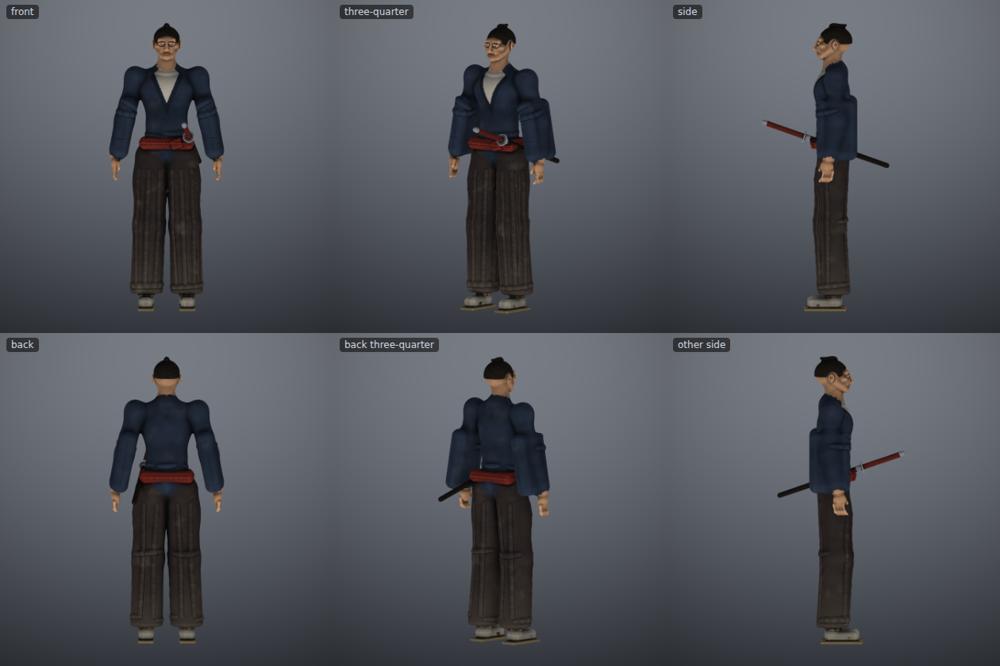
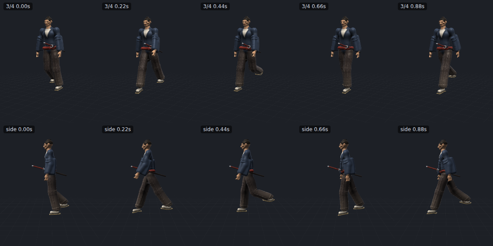

<p align="center"></p>

# Advance Forge

A Claude Code plugin that gives the AI a sculpting studio. It drives **SculptFree**, the sculpting
app in `tools/sculpt`, and the **Rig Player** in `tools/anim` from scripts. With it, the AI builds
characters and props with real brushes and clay forms, rigs them, animates them, looks at every step
as rendered images, and loads the result into the game.

It also comes with the rules for doing that well. `RULES.md` holds:

- the game's style, and what deserves a custom model and what doesn't;
- the nine-stage method and a proportions table;
- how to make models feel 3D (folds, creases, layering, baked shading);
- faces, rigging, animation, and triangle budgets;
- a review checklist, and a table of every pitfall already hit.

| | |
|---|---|
|  |  |

## Install

In this repo it's already active: `.claude/skills/advance-forge` points Claude at it, and
`CLAUDE.md` makes using it mandatory for 3D work.

To use it in another project, as a Claude Code plugin:

```text
/plugin marketplace add ./tools/advance-forge
/plugin install advance-forge@advance-forge-marketplace
```

It needs Node 18+ and Playwright with a Chromium (`npm i -g playwright`). Nothing else: the app and
the player are single HTML files inside the plugin. Check the setup with:

```bash
node tools/advance-forge/skills/advance-forge/scripts/forge.mjs doctor
```

## What's inside

```text
.claude-plugin/          plugin.json, marketplace.json
logo.svg, logo.png       the logo
sync.sh                  refresh app/ from tools/sculpt and tools/anim
skills/advance-forge/
  SKILL.md               the entry point Claude reads first: the hard gate and the loop
  RULES.md               the rule sheet
  API.md                 every scripting call, with pitfalls
  app/                   SculptFree (with rigging) and the Rig Player, one HTML file each
  scripts/               forge.mjs (doctor/build/render/export), rig.mjs, animate.mjs, lib/
  game/forge-loader.js   load a forged, rigged, animated GLB into three.js with the game's rig names
  templates/ronin.js     a complete worked character: build, joints, previews
```

## The pipeline, by hand

```bash
S=tools/advance-forge/skills/advance-forge
node $S/scripts/forge.mjs build $S/templates/ronin.js --out out --name ronin --close "0.4,0.05,1.6,0.16"
node $S/scripts/rig.mjs out/ronin.sculpt --out out --joints $S/templates/ronin_joints.json
node $S/scripts/animate.mjs out/ronin_rigged.glb --out out --bake
# out/ronin_animated.glb  ->  assets/models/, loaded with game/forge-loader.js
```
