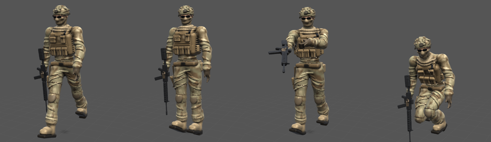

# Rig Player

A small animation viewer for rigged glTF characters. It is one HTML file with
no libraries: it reads the GLB itself, skins the mesh on the GPU with WebGL 2,
and plays animations.

| File | What it is |
| --- | --- |
| `index.html` | The player. Serve the folder and it loads `soldier_rigged.glb`; open any other rigged GLB with **Open GLB** or by dropping it on the page |
| `player.html` | The same player with the soldier embedded, so a double-click opens it with no server (built by `node build.js`) |
| `soldier_rigged.glb` | The soldier from `../sculpt/examples/soldier`, rigged in SculptFree: 21 bones, skin weights, 100k triangles |
| `soldier_animated.glb` | The same file with the four clips baked in as glTF animations, ready for Blender, Unity, Godot or three.js |

## The clips

A skeleton with SculptFree's bone names (Hips, Spine, Chest, Neck, Head,
Shoulder, UpperArm, LowerArm and Hand, and UpperLeg, LowerLeg, Foot and Toes,
each with .L and .R) gets four built-in clips:

- **Walk.** A 1.1-second loop. The thighs swing, the knee bends as the leg
  passes under the body, the foot rolls heel to toe, the hips sway and turn,
  and the chest counter-rotates. The free arm swings while the rifle arm
  stays tucked in, and the ground grid scrolls under him.
- **Idle.** Breathing in the chest and shoulders, weight shifting from foot
  to foot, and a slow look around.
- **Aim & scan.** He brings the rifle up to a ready position, then sweeps it
  left and right from the hips, spine and chest, as if checking the area.
- **Take cover.** He drops to one knee with his head down, looks around, and
  stands back up.

The legs and arms are driven by absolute angles: how far forward of straight
down each bone should point. The player measures each bone's angle in the
rest pose and rotates by the difference. That matters for this model: the
soldier was sculpted mid-stride, and a walk added on top of that pose would
limp.

**T-posed characters** (arms straight out, the way every Advance Forge character is sculpted)
are converted on load. The arms are lowered to hang a little out from the body, the mesh is
skinned into that pose, and that pose becomes the rest pose. The clips then work unchanged, and
exported animations are written back relative to the file's own T-pose. The player also shows a
colour **texture** when the GLB has one, which is how `ship.mjs` delivers its detail.

Animations already inside a GLB show up as extra buttons. **Export GLB +
animations** writes the loaded model back out with the built-in clips baked
in at 30 fps.

## Controls

Drag to orbit, and use the wheel or pinch to zoom. Space plays and pauses,
the slider scrubs, and **Skeleton** draws the bones over the model.
