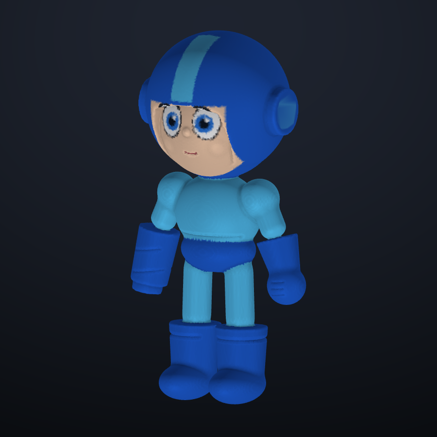

# Mega Man — a scripted sculpt

Built in SculptFree by a script that drives the app's own tools. It is a test
run for letting Claude make 3D models.

| File | What it is |
| --- | --- |
| `megaman.sculpt` | The project. Open it with ☰ → Open project |
| `megaman.glb` | The model with vertex colours, for Blender, Unity or Godot (160k triangles) |
| `megaman.js` | The build: every shape, colour and stroke, in order |
| `sculptkit.js` | Helpers that drive the app: camera, strokes, pulls, shapes, paint |
| `build.mjs` | Runs `megaman.js` inside the app and writes the files above |

## How it is made

1. **Block out from shapes.** Queue sphere, rounded box, capsule and
   cylinder parts: the helmet, a box subtracted for the face opening, the
   face, ear discs, chest, shorts, arms, legs, boots, the fist and the Mega
   Buster. Then weld them all at once. The weld is the same signed-distance
   union the Combine menu uses, but it builds the surface in one pass, so
   the result is one watertight mesh with no build-up of voxel artifacts.
2. **Paint.** Each vertex takes the colour of the part it came from, then the
   forehead stripe, ear lights, eyes and mouth are painted on top.
3. **Sculpt.** Real brush strokes through the stroke engine: Inflate on the
   cheeks, Crease for the mouth, the belt line, the grooves under the boot
   cuffs, the finger grooves on the fist and the rings on the Buster.

Rebuild it with `node ../../build.js && node build.mjs`. This takes about
25 seconds and needs Playwright's Chromium. Set `TARGET=60000` to export
fewer triangles, but the painted eyes blur below about 150k.
