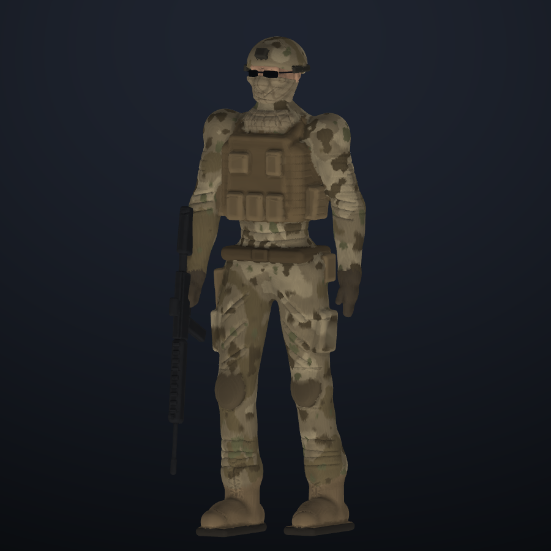

# Soldier: a scripted sculpt, test 2

A stylised-realistic soldier in a helmet, face wrap, sunglasses, plate carrier
and multicam uniform, carrying a carbine. It was built in SculptFree by
scripts that drive the app.

| File | What it is |
| --- | --- |
| `soldier.sculpt` | The project. Open it with ☰ → Open project |
| `soldier.glb` | The model with vertex colours, reduced to 250k triangles |
| `body.js` | The body: skeleton, anatomy, uniform, plate carrier, pouches, belt, hands, boots |
| `head.js` | The head, built up in clay forms and refined with brushes |
| `gear.js` | The helmet, the sunglasses and the face wrap |
| `rifle.js` | The carbine, placed in the right hand |
| `folds.js` | The sculpt pass: cloth folds, webbing, straps, laces and seams, all as brush strokes |
| `paint.js` | The palette: multicam, coyote kit, shemagh check and grime |
| `clay.js`, `sculptkit.js` | Helpers that drive the app |
| `build.mjs` | Runs every step inside the app and writes the files and renders |

## How it is made

- **Anatomy first.** A walking skeleton, with the right leg forward and the
  rifle in the right hand, is fleshed out with tapered limbs and blended clay
  masses. The upper arm has a deltoid, biceps, elbow and forearm, and the
  torso has a ribcage, chest, belly and pelvis rather than one round shape.
- **The head is sculpted.** It is built from a cranium, face mass, brow
  ridge, cheekbones, jaw lines, chin, eye sockets, lids and lips, then
  refined with Smooth, Pinch, Crease, Clay and Flatten strokes. The ears and
  nose are small shapes.
- **The face wrap follows the face.** It is the head's own forms grown by
  6 mm and cut off below the eyes, so the cloth sits on the nose, cheeks and
  chin.
- **Folds are sculpted.** Crease and Clay strokes put bunching behind the
  knees, pulls down the thighs, stacking over the boots, creases at the
  elbows, shirt folds under the carrier, webbing rows, pouch flaps,
  knee-pad straps, toe caps and laces into the joined mesh.

Rebuild with `node ../../build.js && node build.mjs`. This takes about 80
seconds.
